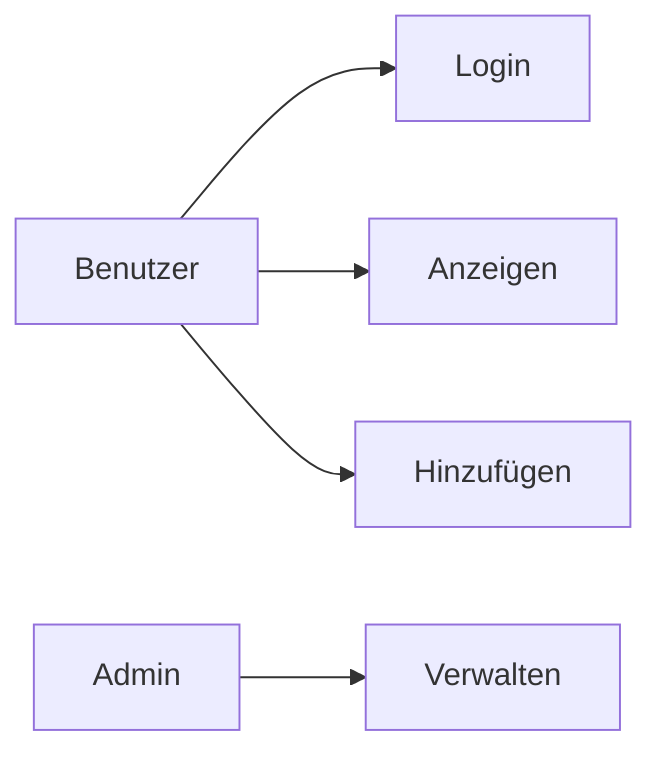

## 📌 1. Was ist ein Use-Case-Diagramm?

Ein **Use-Case-Diagramm** zeigt:

* **Wer** ein System benutzt (→ *Akteure*)
* **Was** diese Personen mit dem System tun (→ *Use Cases*)

👉 Es beschreibt **keinen Code**, sondern die **Funktionen aus Sicht der Benutzer**.

---

## 👤 2. Wichtige Elemente

### 👥 Akteur (Actor)

* Eine Person oder ein externes System
* Beispiele:

  * Benutzer
  * Admin
  * API

➡️ Darstellung: Strichmännchen

---

### ⚙️ Use Case

* Eine Funktion des Systems
* Beispiele:

  * „Login durchführen“
  * „Freund hinzufügen“
  * „Statistik anzeigen“

➡️ Darstellung: Oval

---

### 🔗 Beziehungen

| Beziehung     | Bedeutung                        |
| ------------- | -------------------------------- |
| Linie         | Akteur nutzt Funktion            |
| `<<include>>` | Funktion nutzt immer eine andere |
| `<<extend>>`  | Erweiterung (optional)           |

---

## ✏️ 3. Beispiele

Ein Mini-Beispiel für eine Web-App:

```
Benutzer → (Login)
Benutzer → (Freunde anzeigen)
Benutzer → (Freund hinzufügen)
Admin → (Benutzer verwalten)
```

Oder als Diagramm (Mermaid):



---

Ein Beispiel aus Wikipedia:


---
# 🧩 4. Use-Case-Diagramm für euer Projekt

Jetzt wird’s spannend:
👉 Ihr verwendet das Diagramm, um eure **eigene Anwendung zu planen**

---

## 🧭 Schritt-für-Schritt-Anleitung

### 🥇 Schritt 1: Akteure bestimmen

Fragt euch:

> Wer benutzt meine Anwendung?

Typische Beispiele:

* Benutzer (User)
* Admin
* Gast

---

### 🥈 Schritt 2: Funktionen sammeln

Fragt euch:

> Was kann der Benutzer tun?

Beispiele für euer Projekt:

* Login
* Registrierung
* Daten anzeigen
* Datensatz erstellen
* Datensatz bearbeiten
* Statistik anzeigen

👉 Tipp: Denkt in **Verben**!

---

### 🥉 Schritt 3: Gruppieren

Ordnet die Funktionen:

| Bereich           | Beispiele                    |
| ----------------- | ---------------------------- |
| Authentifizierung | Login, Logout                |
| Daten             | Anzeigen, Erstellen, Löschen |
| Analyse           | Diagramme anzeigen           |

---

### 🏗️ Schritt 4: Diagramm erstellen

Tools:

* [https://mermaid.live](https://mermaid.live)  (Empfohlen, da Mermaid direkt in Obsidian-Markdown eingebettet werden kann!)
* [https://app.diagrams.net](https://app.diagrams.net) 
* [https://www.plantuml.com/plantuml](https://www.plantuml.com/plantuml)


oder aber auch einfach in Excalidraw

---

# 🎯 5. Use-Case-Diagramm als Überblick über eure Programmstruktur

## 💡 Warum das wichtig ist

Ein Use-Case-Diagramm hilft euch:

* Struktur im Projekt zu sehen
* Aufgaben aufzuteilen (z. B. 2 Schüler)
* Controller/Features zu planen

---

## 🔄 Verbindung zu eurem Code (Spring Boot Beispiel)

| Use Case           | Entspricht im Code            |
| ------------------ | ----------------------------- |
| Login              | Controller + Service          |
| Freund hinzufügen  | Controller + Repository       |
| Liste anzeigen     | Controller + View (Thymeleaf) |
| Statistik anzeigen | REST + Chart                  |

---

## 🧠 Beispiel für euer Projekt

Angenommen: „Freunde & Haustiere App“

### Akteure:

* Benutzer
* Admin

### Use Cases:

* Freunde anzeigen
* Freund hinzufügen
* Haustier hinzufügen
* Statistik anzeigen

👉 Daraus entstehen später:

* `FriendController`
* `PetController`
* `StatsController`

---

## 🧱 So nutzt ihr das konkret

1. Zeichnet das Diagramm
2. Jeder Use Case = **eine Funktion im Projekt**
3. Verteilt die Use Cases auf Teammitglieder
4. Baut daraus eure Controller

---

# ⚠️ Häufige Fehler

❌ Zu technisch denken
→ NICHT: „Datenbank speichern“
→ SONDERN: „Freund hinzufügen“

❌ Zu viele Details
→ Keep it simple!

❌ Keine Benutzerperspektive
→ Immer fragen: *Was will der User tun?*

---

# 🔗 6. Weiterführende Quellen

## 📘 Grundlagen

* https://en.wikipedia.org/wiki/Use_case_diagram
* [https://www.lucidchart.com/pages/uml-use-case-diagram](https://www.lucidchart.com/pages/uml-use-case-diagram
* [https://www.visual-paradigm.com/guide/uml-unified-modeling-language/what-is-use-case-diagram/](https://www.visual-paradigm.com/guide/uml-unified-modeling-language/what-is-use-case-diagram/)

## 🎥 Videos

* [https://www.youtube.com/watch?v=4emxjxonNRI](https://www.youtube.com/watch?v=4emxjxonNRI)
* [https://www.youtube.com/watch?v=zid-MVo7M-E](https://www.youtube.com/watch?v=zid-MVo7M-E)

## 🛠 Tools

* [https://app.diagrams.net](https://app.diagrams.net) (sehr gut für Schule)
* [https://mermaid.live](https://mermaid.live) (Text → Diagramm)
* [https://plantuml.com/use-case-diagram](https://plantuml.com/use-case-diagram)
